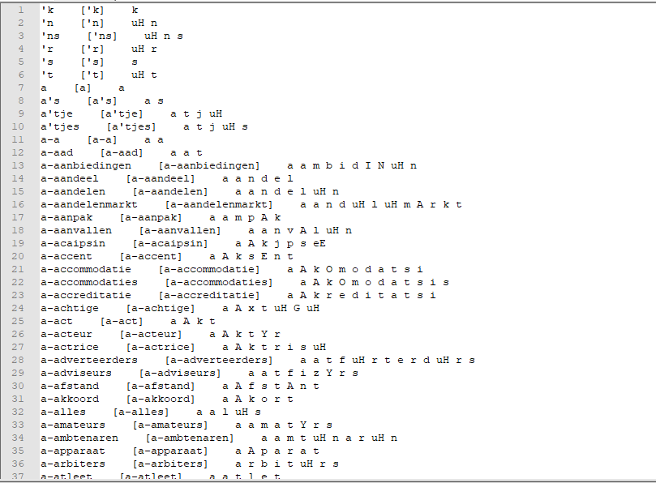
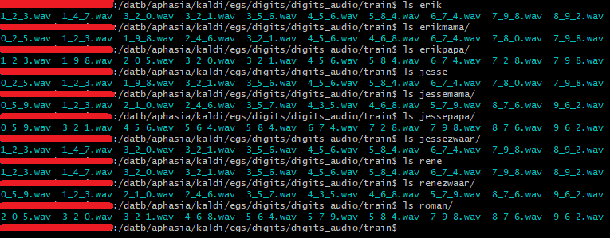
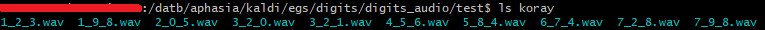
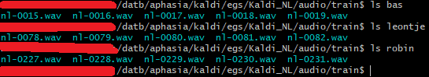
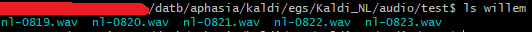
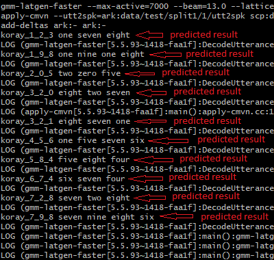
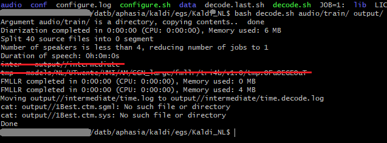

# Aphasia portfolio
<table>
  <tr>
    <td>Naam student</td>
    <td>Ren&eacute; Uhliar</td>
  </tr>
  <tr>
    <td>Studentnummer</td>
    <td>14036738</td>
  </tr>
  <tr>
    <td>Projectthema</td>
    <td>Aphasia</td>
  </tr>
  <tr>
    <td>Begeleidende docent</td>
    <td>Jeroen Vuurens</td>
  </tr>
  <tr>
    <td>Datum</td>
    <td>9 september 2018</td>
  </tr>
</table>

 Dit bestand dient als een readers’ guide van de door mij gemaakte items en behaalde resultaten tijdens het Applied Data Science Semester. 

Deze GitHub repository zal een aantal bestanden bevatten, die als bewijsmateriaal zullen dienen bij de activiteiten genoemd in deze samenvatting. 

 
 

<h2> Behaalde courses </h2>
Hieronder zijn de door mij behaalde courses te vinden
<h3> Datacamp </h3>

De afgeronde Datacamp is in 2 delen gesplitst, omdat het niet op 1 plaatje paste. Het eerste deel is alfabetisch van A naar Z gescreenshot en het tweede deel van Z naar A.

<i>Datacamp deel 1/2</i>

<i>Figuur 1</i>
 
 
<i>Datacamp deel 2/2</i>

<i>Figuur 2</i>
 
 
<h3> Coursera </h3>

De afgeronde Coursera courses zijn op de plaatjes hieronder te zien. De assignments die niet voldaan zijn (oranje) zijn Octave/Matlab programming oefeningen. Deze heb ik niet voldaan, omdat het geen onderdeel was van de minor.

<i>Coursera week 1</i>

<i>Figuur 3</i>
 
 
<i>Coursera week 2</i>

<i>Figuur 4</i>
 
 
<i>Coursera week 3</i>

<i>Figuur 5</i>
 
 
<i>Coursera week 6</i>

<i>Figuur 6</i>
 
 
<h2> Domain Knowledge </h2>
<h3> Used jargon </h3>
<ul>
  <li><b>ASR</b>: ASR staat voor Automatic Speech Recognition. Vertaald betekent dit Automatische spraakherkenning.</li>
  <li><b>g2p-seq2seq</b>: Een <a href="https://github.com/cmusphinx/g2p-seq2seq">tool</a> dat met behulp van een bestaande woordenlijst met woorden en klanken, de lijst kan uitbreiden met nieuwe woorden en klanken. Voorafgaand dient eerst een model getraind te worden gebaseerd op de bestaande lijst.</li>
  <li><b>g2p-seq2seq interactive sessie</b>: een sessie van de g2p-seq2seq tool die met een commando opgestart kan worden, waarbij woorden in de terminal geschreven kunnen worden en de tool genereert de bijbehorende klanken.</li>
  <li><b>Loss</b>: <a href="https://stackoverflow.com/a/42076606/7804385">Loss</a> willen we zo laag mogelijk krijgen tijdens het trainen van een model. Het geeft aan hoe goed of slecht het model is geoptimaliseerd. Hogere percentage betekent slechter getraind.
  <li><b>Phoneme</b>: Een phoneme is een klank. Bijvoorbeeld in het woord "muis" zijn m ui s de phonemen.</li>
  <li><b>Diphone</b>: Een diphone is een phoneme met de overgangsklank naar een andere phoneme. Binen dit project wordt hiernaar gerefereerd bij elke combinatie van twee opeenvolgende klanken samen. Voorbeeld: "Beker" wordt Be ek ke er</li> 
  <li><b>Avatar</b>: Avatar is de naam van de uiteindelijke ASR applicatie die Afasie patienten bij het revalidatieproces zal helpen.</li>
  <li><b>CNN</b>: Staat voor Convolutional Neural Network. Het is een vorm van een neuraal netwerk in Machine Learning terminologie.</li>
  <li><b>MFCC</b>: Staat voor Mel Frequency Cepstral Coefficient. Het is geluid omgezet naar features, floats in dit geval. Deze kunnen voor allerlei data science doeleinden gebruikt worden, zoals bijvoorbeeld data visualisatie.</li>
</ul>
<h3> Literature </h3>
<h4> Algemeeen over Afasie </h4>
<ul>
  <li>https://www.afasienet.com/mensen/afasie/over-afasie/</li>
  <li>https://www.hersenletsel-uitleg.nl/gevolgen/neurologische-gevolgen-nah/afasie-dysartrie-en-spraakapraxie-1</li>
</ul>
<h4> Sphinx en andere ASR tooling gerelateerd </h4>
<ul>
  <li>https://cmusphinx.github.io/wiki/tutoriallm/#language-models</li>
  <li>https://cmusphinx.github.io/wiki/tutorialdict/</li>
  <li>https://en.wikipedia.org/wiki/Acoustic_model</li>
  <li>ftp://m170.limsi.fr/public/csl01.pdf</li>
</ul>
<h4> Sequence to sequence models </h4>
<ul>
  <li>https://www.analyticsvidhya.com/blog/2018/03/essentials-of-deep-learning-sequence-to-sequence-modelling-with-attention-part-i/</li>
  <li>https://blog.keras.io/a-ten-minute-introduction-to-sequence-to-sequence-learning-in-keras.html</li>
  <li>https://nlp.stanford.edu/~johnhew/public/14-seq2seq.pdf</li>
</ul>
<h4> Mel Frequency Cepstral Coefficient (MFCC) </h4>
<ul>
  <li>http://practicalcryptography.com/miscellaneous/machine-learning/guide-mel-frequency-cepstral-coefficients-mfccs/</li>
  <li>https://haythamfayek.com/2016/04/21/speech-processing-for-machine-learning.html</li>
</ul>
 

<h2> Predictive models </h2>
<h3> G2p-seq2seq </h3>

Op figuur 7 is het gebruik van het nieuw getrainde model te zien wat bij <a href="https://github.com/troley/project-aphasia/blob/master/Persoonlijke_portfolio.md#-g2p-seq2seq--1">Diagnostics of the learning process</a> toegelicht wordt. Ik schreef wat woorden op en de g2p interactive sessie genereerde de bijbehorende klanken. Deze konden vervolgens opgeslagen worden in een woordenlijst.

<i>Figuur 7</i>

<h3> Malaria detection CNN </h3>

Naast het werken aan het project heb ik zelf ook nog een CNN gebouwd. Ik was tijdens het project veel bezig met tooling en kwam niet altijd aan het Data Science Machine Learning deel. Hiermee wil ik mijn opgedane skills bevestigen.

In <a href="https://github.com/troley/project-aphasia/blob/master/Malaria_detection_CNN.ipynb">dit jupyter notebook</a> bestand is het predictive model deel te vinden onder de kopjes <b>Building / training a predictive model</b> en <b>Using predictive model</b>

 
 

<h2> Data preparation </h2>
<h3> UvA data extractie unieke woorden </h3>

Mijn collega Jesse heeft weinig coding ervaring. In het team hebben we daarom afgesproken dat we Jesse wat eenvoudigere klusjes zouden laten programmeren. Hierbij is het notebook bestand <a href="https://github.com/troley/project-aphasia/blob/master/text_files_to_dict.ipynb">waarbij uit een tal UvA bestanden unieke woorden worden geextraheerd en in een nieuw bestand worden opgeslagen</a> een voorbeeld die Jesse heeft gecodeerd. Ik gaf hem hierbij tips hoe bepaalde dingen bereikt konden worden. Samen hebben wij hieraan gewerkt om unieke data uit een UvA dataset te krijgen.

<h3> Audio segment extractie en processing </h3>

Het processen van Corpus Gesproken Nederlands (CGN) data voor seq2seq model training was een van mijn taken in sprint 7. Hiervoor heb ik een bestaande set aan csv bestanden (die eerder werd gemaakt door Jesse en Koray) gebruikt. Hierbij heb ik bij <a href="https://www.scrumwise.com/scrum/#/backlog-item/4298-de-meeste-voorkomende-woorden-in-de-cgn-data-in-een-nieuw-bestand-kopieren/id-84641-13034-61">deze Scrumwise ticket</a> de 15 meest voorkomende woorden in de Nederlandse taal genomen, opgezocht en gesneden uit de audio bestanden van CGN. De gesneden audiobestanden heb ik opgeslagen en gebruikt voor het trainen van het seq2seq model.
 

De verdere details zijn in <a href="https://github.com/troley/project-aphasia/blob/master/audio_segment_extractor.ipynb">deze jupyter notebook</a> te vinden.

<h3> Phoneme data extractie uit CGN </h3>

Een van datasets die nodig was voor het leren van de LSTM deep neural netwerk om phonemen te herkennen waren csv bestanden met de structuur begin_tijd,eind_tijd,phoneme,absolute_pad_naar_audio_bestand. Hiervoor heb ik een methode van Koray aangepast, om dit mogelijk te maken. De code en verdere toelichting kan in <a href="https://github.com/troley/project-aphasia/blob/master/awd_wav_phoneme_transformation.ipynb">dit jupyter notebook</a> gevonden worden.

<h3> Kaldi data </h3>

Naast de train en test set die Kaldi nodig had (toegelicht bij Data collection -> Kaldi data), waren er ook een aantal andere data preparation technieken die bij Kaldi toegepast moesten worden voor de data uit de train en test sets. Dit worden hier besproken.

Bij dit voorbeeld zijn alleen plaatjes gebruikt van de train set, om het beknopt te houden. Daarom bevatten sommige plaatjes niet alle data, omdat ze anders te groot en onleesbaar zouden worden. Overigens gebeurt bij de test set exact hetzelfde wat hier gepresenteerd wordt met de train set.

Hieronder volgt de lisjt van de data preparation technieken en een korte toelichting:

<ol>
  <li><b>spk2gender bestand creëren</b>: Dit bestand bevat alle namen van sprekers met achter de naam het geslacht. De letter 'f' (=female) of 'm' (=male) worden hiervoor gebruikt. (Figuur 8)</li>
  <li><b>text bestand creëren</b>: Dit bestand bevat voor elk audio bestand de naam van het bestand met daarnaast de gesproken tekst  (Figuur 9)</li>
  <li><b>utt2spk bestand creëren</b>: Hierin bevinden zich de bestandensnamen per spreker met daarnaast de naam van de specifieke spreker. (Figuur 10)</li>
  <li><b>wav.scp bestand creëren</b>: Dit bestand bevat voor elk audio bestand de naam van het audio bestand met daarnaast het absolute pad naar het audio bestand. (Figuur 11)</li>
</ol>
 
 

<i>Figuur 8</i>
 
 

<i>Figuur 9</i>
 
 

<i>Figuur 10</i>
 
 

<i>Figuur 11</i>
 
 
<h3> Malaria detection CNN </h3>

Naast het werken aan het project heb ik zelf ook nog een CNN gebouwd. Ik was tijdens het project veel bezig met tooling en kwam niet altijd aan het Data Science Machine Learning deel. Hiermee wil ik mijn opgedane skills bevestigen.

In <a href="https://github.com/troley/project-aphasia/blob/master/Malaria_detection_CNN.ipynb">dit jupyter notebook</a> bestand is het data preparation deel te vinden aan het begin onder het kopje <b>Data preparation</b>

 
 

<h2> Data visualization </h2>
<h3> (Py)Kaldi MFCC </h3>

In latere sprints hadden we de focus gelegd op het tonen van klanken op het scherm bij een verkeerd/onbekend woord dat een Afasie patient tegen de Avatar zal uitspreken. Bij <a href="https://www.scrumwise.com/scrum/#/backlog-item/3718-split-audio-in-lesser-e-g-10-ms-bins-and-plot-this/id-84641-11740-0">deze</a> en <a href="https://www.scrumwise.com/scrum/#/backlog-item/3719-research-mfcc-of-kaldi-whether-hamming-window-is-processed-within-it/id-84641-11740-9">deze</a> Scrumwise tickets was het mijn doel om audio om te zetten naar MFCC en dit te visualiseren. Het uitgesproken woord wordt in dat geval op basis van geluidsfrequentie niveau's ontleed en op basis daarvan worden de klanken gegenereerd. Mijn deel hierin was naar (Py)Kaldi MFCC functionaliteit kijken. Dit heb ik gedaan en heb het <a href="https://github.com/troley/project-aphasia/blob/master/pykaldi_features.ipynb">in dit Jupyter Notebook bestand</a> uiteindelijk ook uitgewerkt en geplot.

<h3> Malaria detection CNN </h3>

Naast het werken aan het project heb ik zelf ook nog een CNN gebouwd. Ik was tijdens het project veel bezig met tooling en kwam niet altijd aan het Data Science Machine Learning deel. Hiermee wil ik mijn opgedane skills bevestigen.

In <a href="https://github.com/troley/project-aphasia/blob/master/Malaria_detection_CNN.ipynb">dit jupyter notebook</a> bestand is het data visualizatie deel te vinden onder het kopje <b>Data visualization</b>

<h2> Data collection </h2>
<h3> Voxforge data </h3>

Bij de <a href="https://www.scrumwise.com/scrum/#/backlog-item/4045-research-pocketsphinx-repo/id-84641-12337-0">Scrumwise ticket</a> waar ik onderzoek deed naar PocketSphinx, ben ik VoxForge tegengekomen bij het lezen over <a href="https://cmusphinx.github.io/wiki/tutorialam/#data-preparation">Data preparation</a>. Ik heb verder gekeken naar VoxForge en kwam Nederlands gesproken taal data tegen. Hieruit was voor ons de dictionary het meest zeldzame bestand. Dit bestand hebben we zowel in PocketSphinx als in latere Kaldi experimenten gebruikt. Hieronder is een plaatje te zien bij figuur 12 van de data die de Voxforge dictionary bevat.

 

<i>Figuur 12</i>
 
 
<h3> Kaldi data </h3>
<h4> Engelse dataset </h4>

Om de <a href="http://kaldi-asr.org/doc/kaldi_for_dummies.html">Kaldi for Dummies tutorial</a> bij de <a href="https://www.scrumwise.com/scrum/#/backlog-item/4057-audio-van-10-mensen-verzamelen-voor-kaldi-example/id-84641-12493-2">Scrumwise ticket</a> te kunnen realiseren, heb ik van uiteindelijk 11 verschillende stemmen (inclusief syntetische) opnames verzameld waarin de getallen van één tot tien in het Engels werden uitgesproken. Deze data heb ik volgens de tutorial verwerkt, zodat Kaldi er succesvol mee gerund kon worden.

Hieronder is bij figuur 13 de data die als training set gebruikt zijn te zien en bij figuur 14 de data die als test set gebruikt zijn.

<i>Figuur 13</i>
 
 

<i>Figuur 14</i>
 
 
<h4> Nederlandse dataset </h4>

Hetzelfde wat bij Engelse dataset beschreven staat, is ook van toepassing geweest bij de Nederlandse data voor het Kaldi_NL experiment. Er dient een train en een test set gecreërd te worden. Hiervoor heb ik een aantal audio bestanden uit de Corpus Gesproken Nederlands dataset geëxtraheerd en in de juiste mappen geplaatst. Het waren maar een paar bestanden, om te kijken of het experiment daarmee überhaupt gerund kan worden. Vervolgens is het uiteraard van bealng geweest om meer data te gebruiken. Bij Figuren 15 en 16 zijn de train en test datasets te zien.

<i>Figuur 15</i>
 
 

<i>Figuur 16</i>
 
 
<h2> Evaluation </h2>
<h3>G2p-seq2seq</h3>

Bij de g2p-seq2seq hoort ook de evaluatie van het geleerde model. De evaluatie die bij het framework, en bij dergelijke speech to text model frameworks gebruikt worden, is de Word Error Rate (WER) metric. Bij figuur 17 is de WER en accuracy te zien van de model evaluatie op 10% van de (test) data.

<i>Figuur 17</i>
 
 
<h3> Malaria detection CNN </h3>

Naast het werken aan het project heb ik zelf ook nog een CNN gebouwd. Ik was tijdens het project veel bezig met tooling en kwam niet altijd aan het Data Science Machine Learning deel. Hiermee wil ik mijn opgedane skills bevestigen.

In <a href="https://github.com/troley/project-aphasia/blob/master/Malaria_detection_CNN.ipynb">dit jupyter notebook</a> bestand is het evaluatie deel te vinden onder het kopje <b>Trained model evaluation</b>

<h2> Diagnostics of the learning process </h2>
<h3> G2p-seq2seq </h3>

We hebben een dictionary gevonden met Nederlandse woorden met het formaat &lt;woord&gt; &lt;klank1&gt; &lt;klank2&gt; &lt;klank3&gt; etc. Het oorspronkelijke doel was deze uit te breiden met eigen woorden die patienten verkeerd kunnen uitspreken. Hiervoor heb ik gekeken naar de tool g2p-seq2seq die op basis van een bestaand model (Nederlandse dictionary) kon leren hoe klanken voor nieuwe woorden kunnen worden voorspeld. Dit werd gerealiseerd bij <a href="https://www.scrumwise.com/scrum/#/backlog-item/3525-train-a-g2p-model-with-dutch-language/id-84641-11280-18">deze Scrumwise ticket</a>.

  

Op het plaatje op figuur 18 is te zien dat het trainingsproces 16477 stappen (met groen onderstreept) had genomen en dat het model is geoptimaliseerd naar loss van 13% (met oranje onderstreept). De loss bleef tussen 9% en 15% schommelen en kwam niet meer tot nieuwe progressie, dus heb ik het trainigsproces gestopt op dit punt.

<i>Figuur 18</i>

<h3> Malaria detection CNN </h3>

Naast het werken aan het project heb ik zelf ook nog een CNN gebouwd. Ik was tijdens het project veel bezig met tooling en kwam niet altijd aan het Data Science Machine Learning deel. Hiermee wil ik mijn opgedane skills bevestigen.

In <a href="https://github.com/troley/project-aphasia/blob/master/Malaria_detection_CNN.ipynb">dit jupyter notebook</a> bestand is het learning process diagnostics deel te vinden onder het kopje <b>Diagnostics of the learning process</b>

<h2> Communication </h2>
<h3> Presentations </h3>
<ul>
  <li>Eerste presentatie gegeven door Jesse en mij is <a href="https://github.com/troley/project-aphasia/blob/master/ppt_aphasia_week_4.pdf">hier te vinden</a> (mijn deel vanaf slide 3 t/m het eind)</li>
  <li>Tweede presentatie gegeven door Erik en mij is <a href="https://github.com/troley/project-aphasia/blob/master/ppt_aphasia_week_9.pdf">hier te vinden</a> (mijn deel vanaf slide 5 t/m het eind)</li>
  <li>Derde presentatie gegeven door Jesse en mij is <a href="https://github.com/troley/project-aphasia/blob/master/ppt_aphasia_week_16.pdf">hier te vinden</a> (mijn deel vanaf slide 5 t/m het eind)</li>
</ul>

<h3> Research Paper </h3>

Een van de taken was het schrijven van een research paper omvattend het project. Hieronder de door mij geschreven delen uit de research paper.

<h4>4.2 Existing speech to text solutions</h4>

 For the automatic translation of speech to text there are several solutions readily available. In this section, a few solutions are being described which have been used to see whether one of the existing speech recognition solution will suffice for our project goal.

<h5>4.2.1 Google Speech-To-Text API</h5>

 This project was started with a GSTT (Google Speech-To-Text) experiment. GSTT is an API (Application Programming Interface), which allows developers to implement speech to text solutions quickly and easily. 

 Python library speech_recognition has been used for this purpose. speech_recognition is a high level ASR library. It allows the developer to, among others configure Google speech to text API to be used for ASR. 

 First, GSTT has been used to predict spoken English words and sentences and later on to predict Dutch words and sentences. A microphone laptop has been used. It is also important to notice that it depends on the microphone how well the GSTT recognizes words. 

<h5>4.2.2 Sphinx (PocketSphinx)</h5>

For this experiment, a minimalistic speech recognition was built program. A dictionary of just 10 Dutch words has been used. The program predicted around 8 out of 10 words correctly. Later, a dictionary file of around 1.4 million Dutch words has been used. Simple words e.g. “Hallo” were predicted correctly, but more difficult words e.g. “Experiment” were less frequently predicted correctly.

<h5> 4.3 G2p-seq2seq toolkit (depends-on PocketSphinx)</h5>

PocketSphinx works on a dictionary with words and phonemes. The dictionary in Sphinx already contained around 1.4 million unique Dutch words and phonemes which were considered enough for a first test. The model was trained with the words and phonemes to recognize which phonemes belong to a word.

After the model has been trained, predictions could be made on new Dutch words which are not contained in the dictionary. The model predicted the phonemes that belong to the words. G2P-seq2seq model was used to generate the phonemes of a word.

G2p-seq2seq can be found on GitHub (nurtas-m, 2016). The G2p-seq2seq repository contains clear instructions on how to install and use this toolkit. This toolkit already comes with a pre-trained English word to phoneme prediction model. The instructions can be found in the README.md file on GitHub. The process from README.md file has been repeated to train a Dutch predictive model.

 It is important that TensorFlow 1.8.0 or higher and Tensor2Tensor 1.6.6 or higher are installed at the time of writing this paper. We ran into multiple issues first when these versions were lower, so this is a must. 

<h2> Problem solving & tooling </h2>
<h3> Kaldi toolkit experiments </h3>

Een taak waar ik heel wat tijd aan heb besteed, was het leren van een deel van de Kaldi toolkit. Het meeste van de tijd heb ik aan <a href="http://kaldi-asr.org/doc/kaldi_for_dummies.html">de eerder genoemde Dummies tutorial</a> besteed, waarin de basis van de Kaldi toolkit werd voorgesteld. In eerste instantie heb ik de originele Engelse versie nagemaakt en vervolgens heb ik hetzelfde in het Nederlands gedaan. De gebruikte Nederlandse verzamelde data worden <a href="https://github.com/troley/project-aphasia/blob/master/Persoonlijke_portfolio.md#user-content--kaldi-data-">hier</a> beschreven.

Hieronder op figuur 19 is het resultaat te zien van de predictions van het Kaldi model op de Engelse test set (gesproken door Koray).Er is voor elke prediction een rode pijl getekend om het duidelijk te maken. De tekst die na het bestandsnaam komt is de prediction. <b>Voorbeeld</b>: koray_1_2_3 one seven eight. One seven eight is de prediction (bij 100% accuracy zou dit one two three zijn).

<i>Figuur 19</i>

Er is verder helaas weinig resultaat dat getoond kan worden omtrent het Kaldi_NL (met Nederlandse dataset) werk. Ik liep constant tegen nieuwe problemen aan tijdens het configureren en runnen van Kaldi_NL. Dit is niet zo zeer het probleem van het Kaldi_NL framework - het is gewoonlijk dat het maken van ASR in Kaldi een lastige taak is - maar meer van de tijd die er in moet worden geinvesteerd om het werkend te krijgen. Uiteindelijk hebben we de focus op de fonemen topic gelegd en hebben we de Kaldi mogelijkheid laten liggen.

Bij figuur 20 is de error te zien waar ik als laatste tegen aan liep bij het runnen van de Kaldi ASR, voordat ik aan de fonemen taken begon. De audio bestanden die mee worden geleverd worden waarschijnlijk niet herkend. Dat is op te merken uit de "Duration of speech: 0h:0m:0s" error lijn. Hier zou verder naar moeten worden gekeken.

<i>De doorgestreepte items zijn mijn log berichten uit een van de gerunde Perl scripts.</i>

<i>Figuur 20</i>
