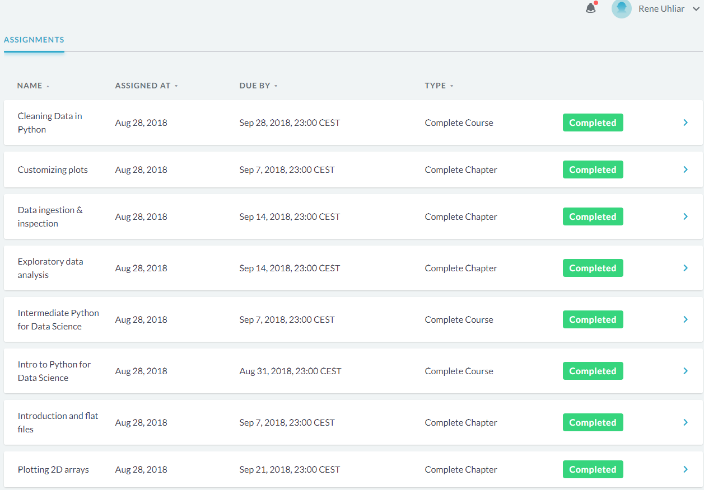
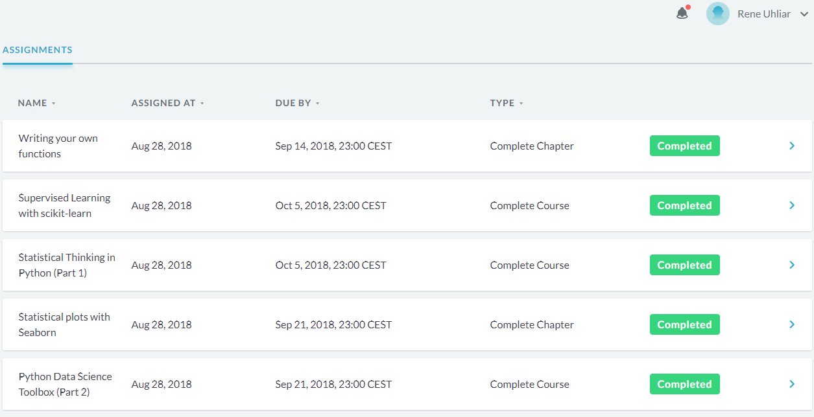
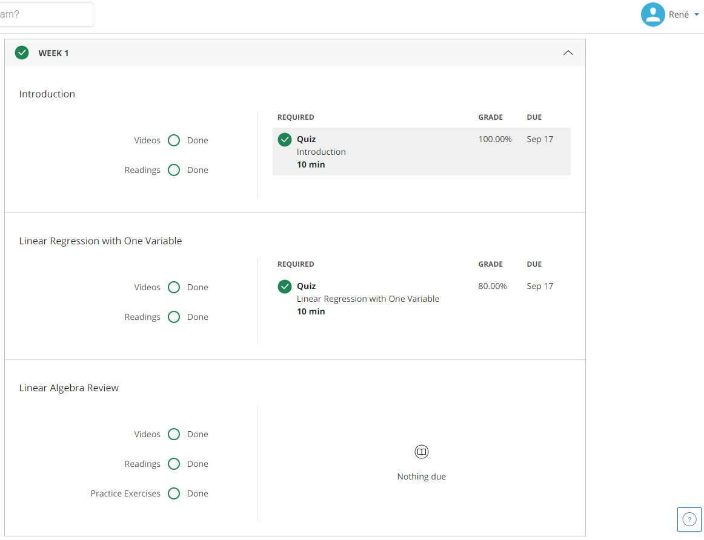
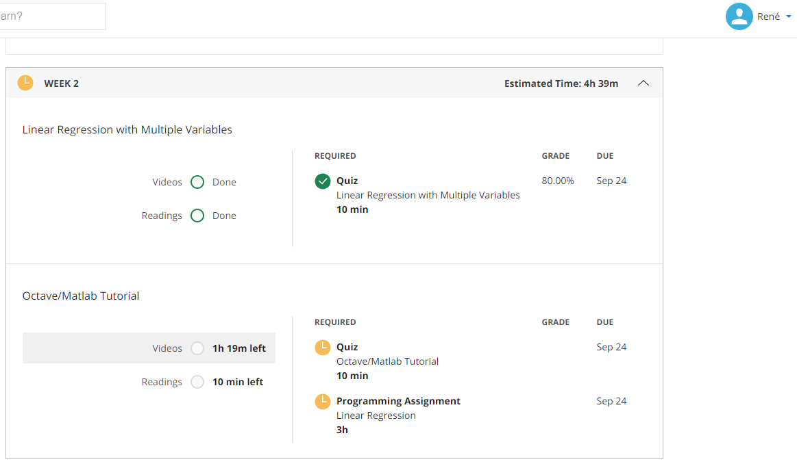
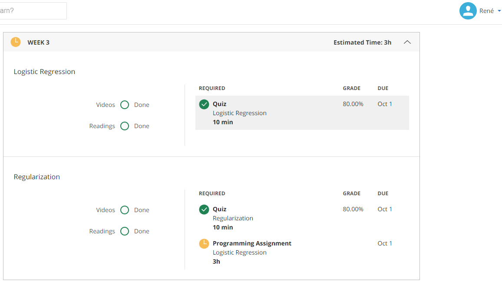
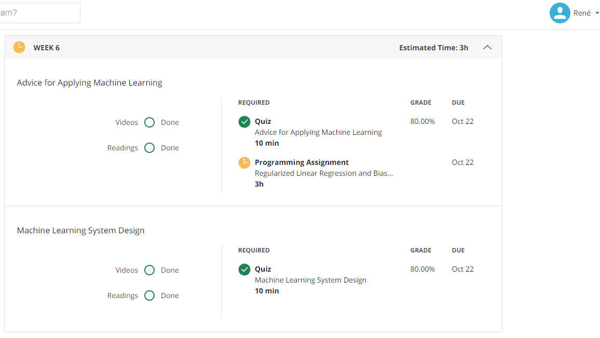
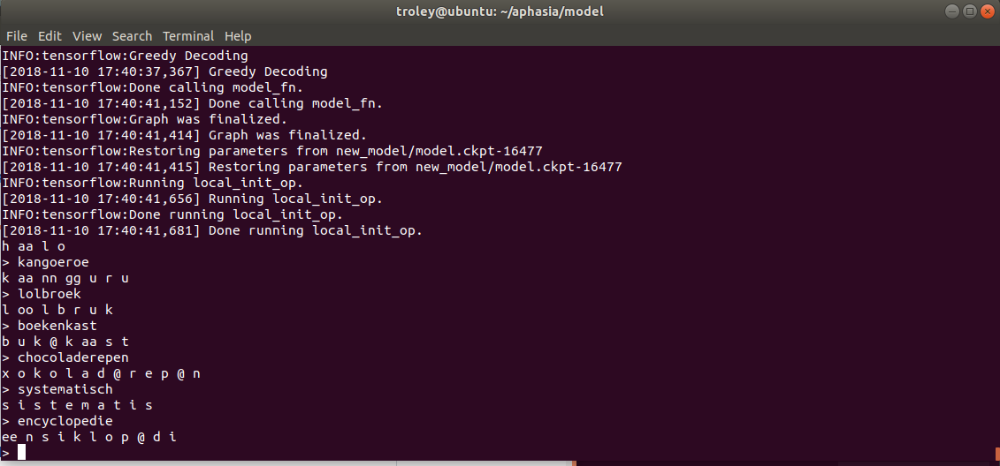
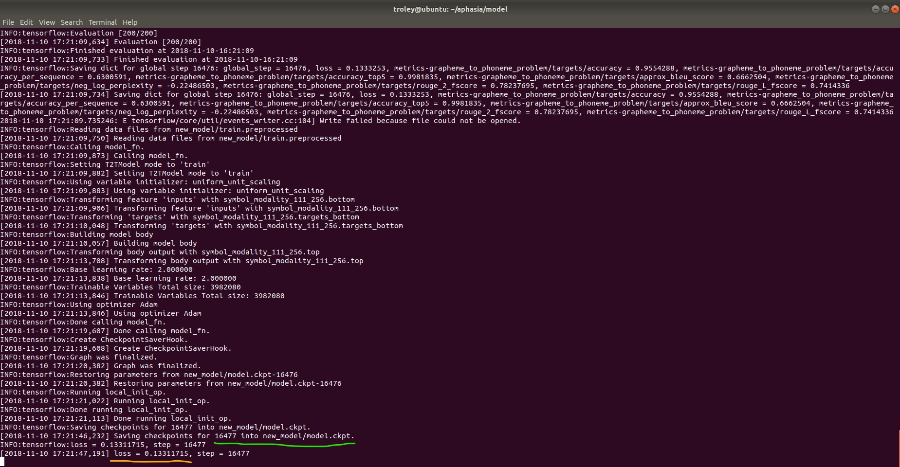

# Aphasia portfolio
<table>
  <tr>
    <td>Naam student</td>
    <td>Ren&eacute; Uhliar</td>
  </tr>
  <tr>
    <td>Studentnummer</td>
    <td>14036738</td>
  </tr>
  <tr>
    <td>Projectthema</td>
    <td>Aphasia</td>
  </tr>
  <tr>
    <td>Begeleidende docent</td>
    <td>Jeroen Vuurens</td>
  </tr>
  <tr>
    <td>Datum</td>
    <td>9 september 2018</td>
  </tr>
</table>

 Dit bestand dient als een readers’ guide van de door mij gemaakte items en behaalde resultaten tijdens het Applied Data Science Semester. 

Deze GitHub repository zal een aantal bestanden bevatten, die als bewijsmateriaal zullen dienen bij de activiteiten genoemd in deze samenvatting. 

 

<i> Een referentielijst met hyperlinks naar de bewijsmateriaal is onderaan dit bestand te vinden.</i>

 

<h2> Behaalde courses </h2>
Hieronder zijn de door mij behaalde courses te vinden
<h3> Datacamp </h3>

De afgeronde Datacamp is in 2 delen gesplitst, omdat het niet op 1 plaatje paste. Het eerste deel is alfabetisch van A naar Z gescreenshot en het tweede deel van Z naar A.

<i>Datacamp deel 1/2</i>

<i>Figuur 1</i>
 
 
<i>Datacamp deel 2/2</i>

<i>Figuur 2</i>
 
 
<h3> Coursera </h3>

De afgeronde Coursera courses zijn op de plaatjes hieronder te zien. De assignments die niet voldaan zijn (oranje) zijn Octave/Matlab programming oefeningen. Deze heb ik niet voldaan, omdat het geen onderdeel was van de minor.

<i>Coursera week 1</i>

<i>Figuur 3</i>
 
 
<i>Coursera week 2</i>

<i>Figuur 4</i>
 
 
<i>Coursera week 3</i>

<i>Figuur 5</i>
 
 
<i>Coursera week 6</i>

<i>Figuur 6</i>
 
 
<h2> Domain Knowledge </h2>
<h3> Used jargon </h3>
<ul>
  <li><b>g2p-seq2seq</b>: Een tool dat met behulp van een bestaande woordenlijst met woorden en klanken, de lijst kan uitbreiden met nieuwe woorden en klanken. Voorafgaand dient eerst een model getraind te worden gebaseerd op de bestaande lijst.</li>
  <li><b>g2p-seq2seq interactive sessie</b>: een sessie van de g2p-seq2seq tool die met een commando opgestart kan worden, waarbij woorden in de terminal geschreven kunnen worden en de tool genereert de bijbehorende klanken.</li>
  <li><b>loss</b>: Loss willen we zo laag mogelijk krijgen tijdens het trainen van een model. Het geeft aan hoe goed of slecht het model is geoptimaliseerd. Hogere percentage betekent slechter getraind. <a href="https://stackoverflow.com/a/42076606/7804385">[1]</a>
</ul>
<h3> Literature </h3>
-	Referentie links uit eerste portfolio
<h3> Evaluation </h3>

<h2> Predictive models </h2>
<h3> G2p-seq2seq </h3>

Op figuur 7 is het gebruik van het nieuw getrainde model te zien wat bij <a href="https://github.com/troley/project-aphasia/blob/master/Persoonlijke_portfolio.md#-g2p-seq2seq--1">Diagnostics of the learning process</a> toegelicht wordt. Ik schreef wat woorden op en de g2p interactive sessie genereerde de bijbehorende klanken. Deze konden vervolgens opgeslagen worden in een woordenlijst.

<i>Figuur 7</i>
 
 
<h2> Data preparation </h2>
-	Python bestand Jesse en ik zinnen in goede format krijgen
-	Python bestand door sprekers ingesproken woorden in een set() krijgen

<h2> Data visualization </h2>
-	Mfcc plot 

<h2> Data collection </h2>
-	Voxforge NL data vinden, downloaden en gebruiken met Pocketsphinx en Kaldi
-	Kaldi opnames van mensen verzamelen en verwerken in Kaldi

<h2> Evaluation </h2>
-	G2p-seq2seq Word Error Rate plaatje laten zien
<h2> Diagnostics of the learning process </h2>
<h3> G2p-seq2seq </h3>

We hebben een dictionary gevonden met Nederlandse woorden met het formaat &lt;woord&gt; &lt;klank1&gt; &lt;klank2&gt; &lt;klank3&gt; etc. Het oorspronkelijke doel was deze uit te breiden met eigen woorden die patienten verkeerd kunnen uitspreken. Hiervoor heb ik gekeken naar de tool g2p-seq2seq die op basis van een bestaand model (Nederlandse dictionary) kon leren hoe klanken voor nieuwe woorden kunnen worden voorspeld.

  

Op het plaatje op figuur 8 is te zien dat het trainingsproces 16477 stappen (met groen onderstreept) had genomen en dat het model is geoptimaliseerd naar loss van 1.3% (met oranje onderstreept). De loss bleef tussen 0.9% en 1.5% schommelen en kwam niet meer tot nieuwe progressie, dus heb ik het trainigsproces gestopt op dit punt.

<i>Figuur 8</i>

<h2> Communication </h2>
-	Presentaties
-	E-mail naar Roelant
-	Research paper 
